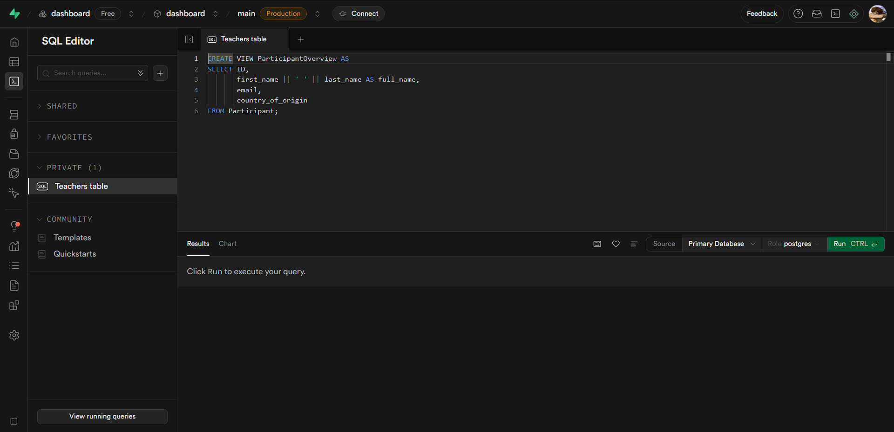
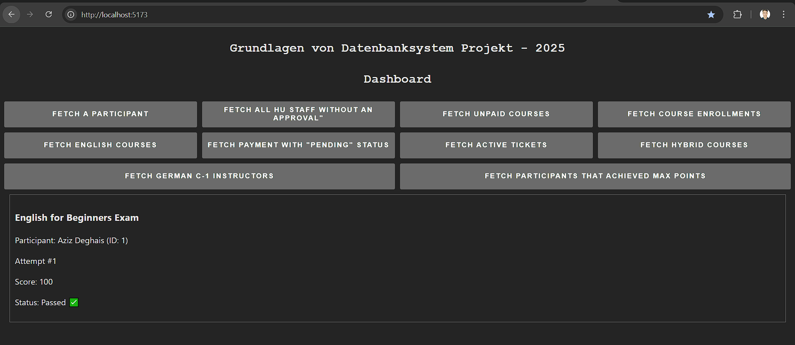

# Grundlagen von Datenbanksystemen - Projekt
## 1. Introduction
This repository contains the project documentation for the course Fundamentals of Database Systems.
The goal of this project is to practically apply core database concepts and to develop a functional solution that demonstrates the use of a SQL Database.  

## 2. Prerequisites
`npm install npm@latest -g`  

## 3. Installation  
1. Get your free account on Supabase (Supabase_URL & Supabase_Password are required to link them to backend server.
2. Clone the repository `git clone https://github.com/azizdeghais/GDBS-I.git`
3. Install npm packages `npm i`
4. Change git remote url to avoid accidental merges

## 4. Technologies & Tools:  
Programming language(s): Typescript/Javascript  
Database management system: PostgreSQL (Supabase Cloud-Hosted Platform)    
Tools/Frameworks: Node.js (Backend), React.js (Frontend)     

## 5. Implementation:
### Backend  
#### Connecting to Database:
`import { createClient } from "@supabase/supabase-js";`  
`const supabaseUrl =`  
`const supabaseKey`  
`const supabase = createClient(supabaseUrl, supabaseKey);`  
#### Example Usage of an API:  
`app.get("/api/teachers", async (req, res) => {  
  const { data, error } = await supabase.from("teachers").select("*");  
  if (error) return res.status(500).json({ error: error.message });  
  res.json(data);});`  
This means that whenever the endpoint http://localhost:3000/api/teachers is accessed on your machine, the table named teachers will be fetched from Supabase.  
Based on this simple implementation, we can create additional endpoints that will be used in the frontend dashboard. For example, when a user clicks a button to fetch teachers, this endpoint will be called and the corresponding data will be returned

#### PostgreSQL Database (Supabase):  
  
SQL commands can be executed on editor to define database or fetch data to create views.  
##### EXAMPLE OF CREATING A TABLE:  
Inserting this piece of code into the SQL Editor would create an empty table on our database.  
`CREATE TABLE Participant (
    ID INT PRIMARY KEY,
    first_name VARCHAR(50) NOT NULL,
    last_name VARCHAR(50) NOT NULL,
    email VARCHAR(100) UNIQUE NOT NULL,
    date_of_birth DATE,
    country_of_origin VARCHAR(50)
);`

#### Dashboard::  
  

## SQL DDL STATEMENTS:
`CREATE TABLE Participant (
    ID SERIAL PRIMARY KEY,
    f_name VARCHAR(50) NOT NULL,
    l_name VARCHAR(50) NOT NULL,
    email VARCHAR(100) UNIQUE NOT NULL,
    country_of_origin VARCHAR(50) NOT NULL,
    date_of_birth DATE NOT NULL
);`

`CREATE TABLE Student (
    matriculation_number SERIAL PRIMARY KEY REFERENCES Participant(ID),
    type CHAR(8) CHECK (type IN ('Humboldt', 'Charite', 'Erasmus'))
);`

`CREATE TABLE HU_Staff (
    staff_ID SERIAL PRIMARY KEY REFERENCES Participant(ID),
    approval BOOLEAN
);`

`CREATE TABLE Instructor (
    ID SERIAL PRIMARY KEY,
    f_name VARCHAR(50) NOT NULL,
    l_name VARCHAR(50) NOT NULL,
    email VARCHAR(100) UNIQUE NOT NULL,
    phone INTEGER
);`

`CREATE TABLE AcademicTitle (
    instructor_ID SERIAL REFERENCES Instructor(ID),
    title VARCHAR(50) NOT NULL,
    PRIMARY KEY (instructor_ID, title)
);`

`CREATE TABLE Course (
    ID SERIAL PRIMARY KEY,
    title VARCHAR(100) NOT NULL,
    level VARCHAR(20),
    language VARCHAR(50) NOT NULL,
    format CHAR(6) CHECK (format IN ('OnSite', 'Online', 'Hybrid'))
);`

`CREATE TABLE IsTaughtBy (
    course_ID SERIAL REFERENCES Course(ID),
    instructor_ID SERIAL REFERENCES Instructor(ID),
    PRIMARY KEY (course_ID, instructor_ID)
);`

`CREATE TABLE Payment (
    ID SERIAL PRIMARY KEY,
    participant_ID SERIAL NOT NULL REFERENCES Participant(ID),
    status CHAR(10) CHECK (status IN ('Pending', 'Processing', 'Completed', 'Failed')),
    amount DECIMAL(6, 2),
    method CHAR(13) CHECK (method IN ('Cash', 'Credit Card', 'Debit Card', 'Bank Transfer')),
    date DATE NOT NULL
);`

`CREATE TABLE Enrollment (
    ID SERIAL PRIMARY KEY,
    participant_ID SERIAL NOT NULL REFERENCES Participant(ID),
    course_ID SERIAL NOT NULL REFERENCES Course(ID),
    payment_ID SERIAL REFERENCES Payment(ID),
    status CHAR(10) CHECK (status IN ('Pending', 'Waitlist', 'Active', 'Completed', 'Cancelled')),
    date DATE NOT NULL,
    placement BOOLEAN
);`

`CREATE TABLE Test (
    ID SERIAL PRIMARY KEY,
    course_ID SERIAL NOT NULL REFERENCES Course(ID),
    title VARCHAR(100),
    type VARCHAR(20),
    max_score INTEGER NOT NULL CHECK (max_score > 0),
    passing_score INTEGER NOT NULL (passing_score >= 0),
    duration INTERVAL,
    attempt_limit INTEGER NOT NULL CHECK (attempt_limit > 0)
);`

`CREATE TABLE TestAttempt (
    test_ID SERIAL REFERENCES Test(ID),
    participant_ID SERIAL REFERENCES Participant(ID),
    attempt_number INTEGER NOT NULL CHECK (attempt_number > 0),
    score INTEGER NOT NULL,
    passed BOOLEAN,
    PRIMARY KEY (test_ID, participant_ID, attempt_number)
);`

`CREATE TABLE Certificate (
    course_ID SERIAL NOT NULL REFERENCES Course(ID),
    participant_ID SERIAL NOT NULL REFERENCES Participant(ID),
    issued_at DATE NOT NULL,
    PRIMARY KEY (course_ID, participant_ID)
);`

`CREATE TABLE Classroom (
    building_name VARCHAR(100),
    room_number CHAR(4),
    wheelchair_access BOOLEAN NOT NULL DEFAULT FALSE,
    PRIMARY KEY (building_name, room_number)
);`

`CREATE TABLE Schedule (
    course_ID SERIAL NOT NULL REFERENCES Course(ID),
    day_of_week SMALLINT NOT NULL CHECK (day_of_week BETWEEN 1 AND 7),
    start_time TIME,
    end_time TIME,
    frequency VARCHAR(20) NOT NULL,
    start_date DATE NOT NULL,
    end_date DATE NOT NULL CHECK (end_date >= start_date),
    PRIMARY KEY (course_ID, day_of_week, start_time)
);`

`CREATE TABLE CourseClassroom (
    course_ID SERIAL NOT NULL REFERENCES Course(ID),
    building_name VARCHAR(100),
    room_number CHAR(4),
    PRIMARY KEY (course_ID, building_name, room_number),
    FOREIGN KEY (building_name, room_number) REFERENCES Classroom(building_name, room_number)
);`

`CREATE TABLE CourseOnline (
    course_ID SERIAL REFERENCES Course(ID),
    url VARCHAR(1000),
    platform VARCHAR(50),
    PRIMARY KEY (course_ID, url)
);`

`CREATE TABLE CourseMaterial (
    title VARCHAR(100),
    year INTEGER,
    author VARCHAR(100),
    type VARCHAR(50) NOT NULL,
    PRIMARY KEY (title, year, author)
);`

`CREATE TABLE CourseHasMaterial (
    course_ID SERIAL NOT NULL REFERENCES Course(ID),
    title VARCHAR(100),
    year INTEGER,
    author VARCHAR(100),
    PRIMARY KEY (course_ID, title, year, author),
    FOREIGN KEY (title, year, author) REFERENCES CourseMaterial(title, year, author)
);`

`CREATE TABLE Staff (
    ID SERIAL PRIMARY KEY,
    f_name VARCHAR(50) NOT NULL,
    l_name VARCHAR(50) NOT NULL,
    phone INTEGER,
    email VARCHAR(100) UNIQUE NOT NULL
);`

`CREATE TABLE StaffAdmin (
    admin_ID SERIAL PRIMARY KEY REFERENCES Staff(ID),
    system_privileges VARCHAR(100)
);`

`CREATE TABLE StaffSupport (
    support_ID SERIAL PRIMARY KEY REFERENCES Staff(ID),
    branch VARCHAR(100),
    location VARCHAR(100)
);`

`CREATE TABLE StaffSecretary (
    secretary_ID SERIAL PRIMARY KEY REFERENCES Staff(ID),
    department VARCHAR(100)
);`

`CREATE TABLE Ticket (
    ID SERIAL PRIMARY KEY,
    title VARCHAR(100) NOT NULL,
    description VARCHAR(1000),
    status VARCHAR(20) NOT NULL,
    category VARCHAR(50),
    created_at TIMESTAMP NOT NULL,
    closed_at TIMESTAMP
);`

`CREATE TABLE Notification (
    ID SERIAL PRIMARY KEY,
    staff_ID SERIAL NOT NULL REFERENCES Staff(ID),
    title VARCHAR(100) NOT NULL,
    message VARCHAR(1000) NOT NULL,
    type VARCHAR(50),
    date TIMESTAMP NOT NULL
);`

`CREATE TABLE ProcessedBy (
    ticket_ID SERIAL REFERENCES Ticket(ID),
    staff_ID SERIAL REFERENCES Staff(ID),
    date TIMESTAMP NOT NULL,
    PRIMARY KEY (ticket_ID, staff_ID, date)
);`

`CREATE TABLE SentTo (
    notification_ID SERIAL REFERENCES Notification(ID),
    participant_ID SERIAL REFERENCES Participant(ID),
    PRIMARY KEY (notification_ID, participant_ID)
);`

`CREATE VIEW active_enrollments AS
SELECT
    e.ID AS enrollment_ID,
    p.ID AS participant_ID,
    p.f_name,
    p.l_name,
    p.email,
    c.ID AS course_ID,
    c.title AS course_title,
    c.level,
    c.language,
    e.date AS enrolled_at,
    e.placement
FROM Enrollment AS e
JOIN Participant AS p ON p.ID = e.participant_ID
JOIN Course AS c ON c.ID = e.course_ID
WHERE e.status = 'Active';`

`CREATE INDEX idx_enrollment_participant ON Enrollment(participant_ID);`
`CREATE INDEX idx_enrollment_course ON Enrollment(course_ID);`

## TEN SQL REQUESTS:
-- Fetch a participant
`SELECT *`
`FROM Participant`
`WHERE ID = $1;`

-- Fetch all HU_Staff without an approval
`SELECT *`
`FROM Participant`
`JOIN HU_Staff ON staff_ID = ID`
`WHERE approval = FALSE;`

-- Fetch all free courses
`SELECT *`
`FROM Course`
`JOIN Enrollment AS e ON e.course_ID = ID`
`WHERE e.payment_ID IS NULL;`

-- Fetch the enrollment number of each course
`SELECT`
`    course_ID,`
`    course_title,`
`    COUNT(participant_ID) AS enrollments`
`FROM active_enrollments`
`GROUP BY course_ID, course_title`
`ORDER BY course_ID;`

-- Fetch all english courses
`SELECT *`
`FROM Course`
`WHERE language = 'English'`

-- Fetch all pending payments
`SELECT *`
`FROM Payment`
`WHERE status = 'Pending'`

-- Fetch 5 most recently opened tickets
SELECT *`
`FROM Ticket`
`WHERE closed_at IS NULL`
`ORDER BY created_at DESC`
`LIMIT 5;`

-- Fetch hybrid courses
`SELECT *`
`FROM Course`
`WHERE format = 'Hybrid'`

-- Fetch all C1-german course instructors
`SELECT DISTINCT`
`    i.ID,`
`    i.f_name,`
`   i.l_name,`
`   i.email`
`FROM Course AS c`
`JOIN IsTaughtBy AS t ON t.course_ID = c.ID`
`JOIN Instructor AS i ON i.ID = t.instructor_ID`
`WHERE c.language = 'German' AND c.level = 'C1';`

-- Fetch all participants that achieved max points in the final exam
SELECT `
    ID,`
    f_name,`
    l_name`
FROM Participant`
WHERE ID IN (`
`    SELECT participant_ID`
`    FROM TestAttempt AS ta`
`    JOIN Test AS t ON t.ID = ta.test_ID`
`    WHERE t.type = 'final' AND ta.score = t.max_score`
`);`
